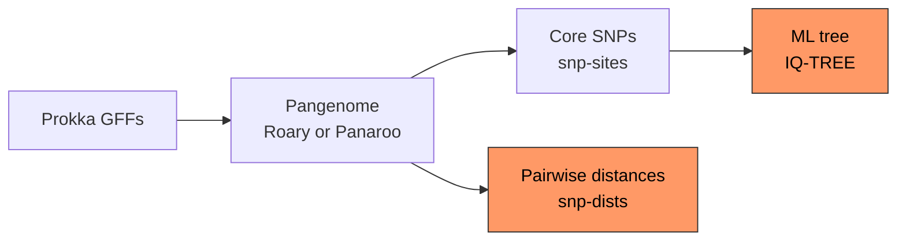

<p align="center">
  <em>⚠️ For research use only. Results were obtained by procedures that were not CLIA validated.</em>
</p>

<p align="center">
  
  
</p>

## 🦠🌳 Overview

Talbot is Florida BPHL's Nextflow pipeline for bacterial core genome SNP phylogeny. It is the downstream step after [Sanibel](https://github.com/BPHL-Molecular/Sanibel): it takes the Prokka GFF files Sanibel writes for each sample, builds a pangenome with Roary or Panaroo, extracts the core genome SNPs, computes pairwise SNP distances and infers a maximum likelihood tree with IQ-TREE.

Talbot is built for relatedness and outbreak investigation, so all genomes in a run should be the same species and, ideally, share a sequence type or serotype. A pangenome across species or genera has almost no core genes, and the resulting tree is not meaningful.

### ⚙️ Dependencies

- **Nextflow** 23.04 to 26.x - [installation guide](https://github.com/nextflow-io/nextflow)
- **Apptainer/Singularity** - [installation guide](https://apptainer.org/docs/user/latest/)
- **SLURM** workload manager (required for HiPerGator; otherwise not required)

All bioinformatics tools run inside containers, no additional software installation is required.

### 🛠️ Setup

#### 1. Clone this repository and enter the repository directory

```bash
$ git clone https://github.com/BPHL-Molecular/Talbot
$ cd Talbot/
```

#### 2. Collect the GFF files

Talbot needs at least 4 Prokka GFF3 files with the `##FASTA` section at the end, which is what Prokka writes by default. Sanibel publishes one per sample at `<sanibel_output>/<sample>/assembly/prokka/<sample>.gff`:

```bash
$ mkdir -p /full/path/to/gffs
$ cp /full/path/to/sanibel_output/*/assembly/prokka/*.gff /full/path/to/gffs/
```

Copy only the samples you want in the tree.

#### 3. Configure params.yaml

```yaml
# Input / Output absolute paths, no trailing slash "/"
input:  "/full/path/to/gffs"
output: "/full/path/to/output"

# Pangenome tool: "roary" or "panaroo"
pangenome: "roary"
```

#### 4. Configure talbot.sh

Add your email address for job notifications and set `NXF_APPTAINER_CACHEDIR` to your image cache directory:

```bash
#SBATCH --mail-user=your@email.gov
export NXF_APPTAINER_CACHEDIR=/path/to/apptainer/cache
```

### 🐊 HiPerGator Usage
```bash
sbatch talbot.sh
```

### ⚡ Local Usage
```bash
nextflow run talbot.nf -profile apptainer -params-file params.yaml
```

### Pangenome tool

Set `pangenome` in `params.yaml` to `"roary"` or `"panaroo"`. Roary is the shipped setting, so results stay comparable with earlier Talbot runs.

Panaroo corrects for annotation errors from fragmented assemblies, contamination and misassemblies ([Tonkin-Hill et al. 2020](https://doi.org/10.1186/s13059-020-02090-4)). Talbot runs it in strict mode and uses its filtered core alignment, which drops high-entropy genes. SNP distances from the two tools can differ, so compare runs made with the same tool.

### Workflow Diagram



### 🧩 Modules

Talbot is made possible thanks to the following tools:

[Roary](https://github.com/sanger-pathogens/Roary) · [Panaroo](https://github.com/gtonkinhill/panaroo) · [snp-sites](https://github.com/sanger-pathogens/snp-sites) · [snp-dists](https://github.com/tseemann/snp-dists) · [IQ-TREE](https://github.com/iqtree/iqtree3)

### 📁 Output

All results are written to `params.output/`:

| Path | Contents |
|------|----------|
| `roary/` | Roary pangenome (`pangenome: "roary"`): `core_gene_alignment.aln`, `gene_presence_absence.csv`, `summary_statistics.txt` |
| `panaroo/` | Panaroo pangenome (`pangenome: "panaroo"`): `core_gene_alignment_filtered.aln`, `gene_presence_absence.csv`, `summary_statistics.txt` |
| `snp_sites/core_snps.fasta` | Variable sites of the core gene alignment |
| `snp_dists/pairwise_matrix.tsv` | Pairwise SNP distances over the core gene alignment |
| `iqtree/core_snps.treefile` | Maximum likelihood tree, UFBoot and SH-aLRT support (1000 replicates each) |
| `iqtree/core_snps.contree` | UFBoot consensus tree |
| `iqtree/core_snps.iqtree` | IQ-TREE report, including the best-fit model |
| `iqtree/core_snps.log` | IQ-TREE run log |
| `pipeline_info/` | Nextflow run record: `trace.txt`, `execution_report.html`, `timeline.html` |

`talbot.sh` renames the output directory with a timestamp suffix when the run finishes successfully.

### 📧 Contact
**Email**: bphl-sebioinformatics@flhealth.gov

### ⚖️ License
Talbot is licensed under the [MIT License](LICENSE).
